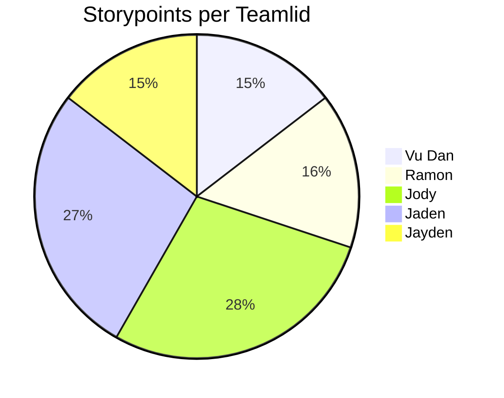

# Retrospective sprint 2

## Verbeterpunten vorige sprint

De verbeterpunt van vorige sprint was alleen dat het mergen vloeiender kon, dat is deze sprint gelukt doordat iedereen nu wist hoe het moest. Het werdt automatisch opgepakt naarmate we meer naar onze verify branch gingen mergen na aanpassingen. Hierdoor kon ieder voor zich zelf (ook thuis zonder hulp) mergen zonder conflicten.

## Uitkomst retrospective (spotify kit)
**Positieve punten**:
- Uitstekende communicatie binnen het team.  
- Iedereen is bereid elkaar te helpen.  
- Consistent werktempo.  
- Openstaan voor nieuwe ideeën.  
- Flexibiliteit van elk teamlid.  
- Iemand neemt altijd het initiatief wanneer er een probleem is.  

**Verbeterpunten**:
- Code Samenvoegen: Branches één voor één samenvoegen in een sessie waar iedereen aanwezig is.
- Focus op User Stories: Een vaste Scrum Master aanwijzen die het team leidt en het bord beheert.
- Code Commentaar: Zorgen dat iedereen hun functies duidelijk uitlegt in de code commentaren.
- Planning van Merges en Implementaties: Merges plannen zodat werkende bestanden klaar zijn voor een soepele integratie op de dag zelf.
- Duidelijke Verwachtingen: Een goed begrepen doel voor het team hebben om naartoe te werken voor betere richting en focus.

**Retro Scores**:
Alle teamleden hebben de sprint als een 5 uit 5 beoordeeld, wat wijst op een succesvolle en positieve sprintervaring.
Zorg ervoor dat je deze punten toepast op je sprint door de acties te koppelen aan specifieke taken of doelstellingen voor de volgende sprint en duidelijke verantwoordelijkheden voor verbeteringen toe te wijzen aan de juiste teamleden. Ga voort met de goede communicatie en teamwork, en gebruik de beoordelingen om voortdurende verbetering te stimuleren.

## Tips voor blok 4

3 Tips (3 aangezien we geen feedback hebben gekregen tijdens de review):
- Een beter systeem hebben om de user stories op done te zetten, we hadden ze nu per kamers en je kon niet duidelijk zien welke nou echt afgemaakt was.
- De puntenverdeling op een betere manier indelen, nu gingen we een beetje op gevoel af hoeveel punten een user story waard was, misschien op basis hoeveel tijd het heeft gekost.
- De gehele game eerder testen voordat we het gaan prestenteren, zodat alles alles in orde is en dat we geen stukken missen.

## Belbinrollen
### Wat we goed doen en waar we aan kunnen werken:
**Goede punten**: 
We zijn goed in plannen maken en dingen voor elkaar krijgen omdat we veel 'Bedrijfsmannen' in ons team hebben.Onze 'Plant' is super in nieuwe ideeën verzinnen, wat ons echt helpt als we iets nieuws nodig hebben.

**Punten om aan te werken**:
We denken soms allemaal een beetje hetzelfde, en dat maakt het lastig om met iets heel nieuws te komen. We leunen heel erg op één persoon voor nieuwe ideeën, en dat is best veel druk op diegene.

**Te veel van hetzelfde**:
Omdat we veel 'Bedrijfsmannen' hebben, zijn we soms te veel bezig met doen en vergeten we na te denken over of er ook andere manieren zijn.

**Wat we missen**:
We hebben meer mensen nodig die goed zijn in praten met anderen en nieuwe dingen vinden, of iemand die ons helpt om kritisch na te denken over ons werk. 

**Als teamleider zorg ik ervoor dat**:
Iedereen zijn ideeën kan delen, ook al zijn ze heel anders. We onze 'Plant' helpen, zodat niet alles op die ene persoon aankomt. We een goede mix houden van doen wat we moeten doen en nieuwe dingen proberen.

## Aandeel teamleden

Het valt op dat Jody en Jaden een stuk meer *storypoints* hebben dan de rest, dit komt omdat ze 2 kamers hadden en de rest maar 1.

## Feedback voor teamleden
### Feedback teamlid
Top voor:
**Vudan**: Je code is mooi overzichtelijk en je communiceert goed of je er bent of niet
**Jaden**: Je communiceert veel, en je presenteerd goed
**Ramon**: Je code is overzichtelijk en goed je kamer bedacht
**Jayden**: Je kamer is goed en leuk bedacht en je bent altijd actief in de les
**Jody**: Jody communiceert goed met iedereen en houdt iedereen op de hoogte.

Tips voor:
**Vudan**: Als je iets niet begrijpt eerder vragen en maak meer user stories.
**Jaden**: Kijk meer naar je user stories
**Ramon**: Zet betere weights bij je user stories en meer aanwezig zijn
**Jayden**: Maak meer user stories
**Jody**: Hoofdletter bestanden en kijk meer naar user stories