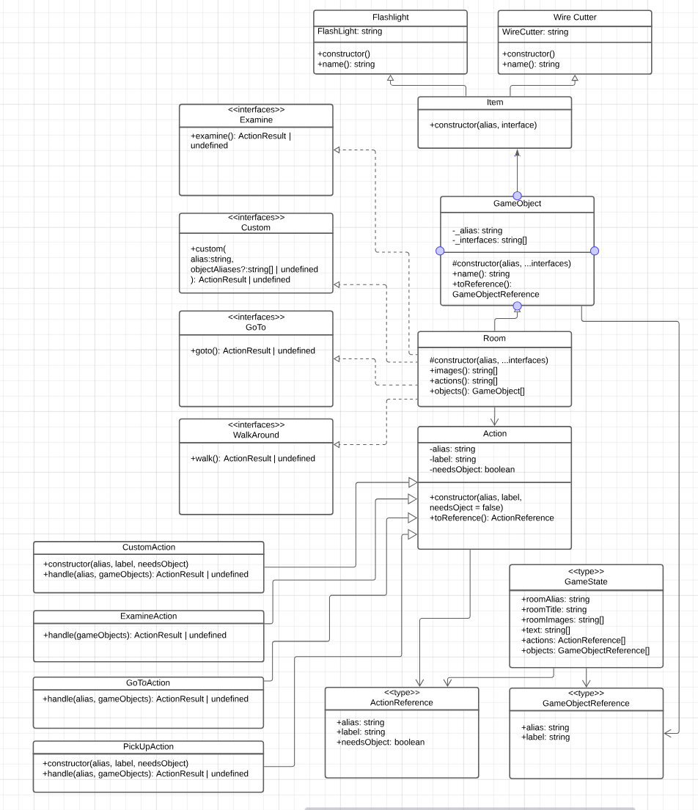

# Expert Review 
In deze expert review behandel ik een aantal **learning stories** met daarbij voorbeelden waarbij ik de learning stories heb toegepast en uitleg geef waarom het principe aankaart en juist weergeeft. Daarnaast heb ik ook een **UML class-diagram** gemaakt van mijn kamer, deze wordt later getoond.

## Als student wil ik leren hoe ik de OO-principes abstraction, encapsulation en inheritance toepas in mijn code & Als student wil ik leren hoe ik abstracte classes toepas in mijn code

### Abstraction
**Principe**: het verbergen van de complexe implementatiedetails en alleen de noodzakelijke kenmerken van een object tonen.

Hieronder wordt *abstraction* bereikt door het gebruik van klassen en methoden om de complexiteit van het systeem te verbergen.

```typescript
/**
 * Hotel room to get the flashlight and wire cutter
 */
export class HotelThreeRoom extends Room implements GoTo {
    /**
     * Create a new instance of this room + call the super constructor
     */
    public constructor() {
        super(HotelRoomThreeAlias, GoToActionAlias);
    }
    /**
     * Switch between rooms
     * 
     * @returns success feedback to switching between rooms
     */
    public goto(): ActionResult | undefined {
        const inventory: string[] = getPlayerSession().inventory;
        const hasHotelRoomCard3: boolean = inventory.includes(HotelRoomCard3Alias);
        const cardName: string = "HotelRoomCard 3";

        /**
         * Requires Hotel Card Room 3 to go inside Room 3
         */
        if (hasHotelRoomCard3) {
            getPlayerSession().currentRoom = this.alias;
            return new TextActionResult(["You have now entered " + this.name()]);
        } else {
            return new TextActionResult(["Room 3 is locked. You need " + cardName + " to enter this room"]);
        }
    }

    public name(): string {
        return "Room 3";
    }
}
```

### Encapsulation
**Principe**: de interne details van een object verbergen en alleen de belangrijkste functionaliteiten aan de buitenwereld laten zien.

```typescript
private roomName: string = "Bathroom";

public name(): string {
    return this.roomName;
}
```

### Inheritance
**Principe**: overerven van eigenschppen en gedrag.

In de code snippet hieronder erft de HotelThreeRoom klasse van de Room klasse.

```typescript
export class HotelThreeRoom extends Room implements GoTo {
    // Inherits properties and methods from Room class
}
```

## Als student wil ik leren hoe ik static functies en variabelen gebruik in mijn code & Als student wil ik leren wat generics zijn en hoe ik ze gebruik in mijn code

### Static functies en variabelen:
- Static functies en variabelen behoren toe aan de klasse zelf, niet aan individuele instanties van die klasse. Dit betekent dat je ze kunt aanroepen/gebruiken zonder een instantie van de klasse te maken.
- Hieronder is te zien dat er een static functie handle is die de logica bevat voor het afhandelen van de "walk around" actie. Deze functie kan worden aangeroepen zonder een instantie van de klasse te maken waarin deze is gedefinieerd (WalkAroundAction). Dit is handig omdat je alleen de interfacefunctie wilt aanroepen en geen instantie van de klasse nodig hebt.

### Generics
- Generics stellen je in staat om types als parameters door te geven aan functies, klassen, en interfaces. Hierdoor kun je herbruikbare componenten maken die met verschillende datatypen kunnen werken zonder de noodzaak van typecasting.
- Hieronder is te zien dat ik gebruik maak van generics in de functie castTo<T>. Deze functie accepteert een typeparameter "T" (in het voorbeeld hieronder "Walk"), waardoor je dynamisch kunt bepalen welk type je wilt teruggeven, zonder expliciet de functie voor elk type te moeten definiëren.
```typescript
/**
 * Handle the walk around action, static functie, no instances needed
 * Typescript can't cast to something it's not sure about
 * 
 * @param gameObjects GameObjects on wich the walk around action should be executed.
 * 
 * @returns Result of the action
 */
 public static handle(gameObject: GameObject): ActionResult | undefined {
    if (implementsInterface(gameObject, WalkAroundAlias)) {
        return castTo<Walk>(gameObject).walk();
    }

    return undefined;
}
```

## Als student wil ik leren hoe ik interfaces toepas in mijn code & Als student wil ik leren hoe ik het OO-principe polymorfisme toepas in mijn code.
### Polymorfisme
**Eenvoudige Principe**: één interface, meerdere implementaties  

In de code snippet is te zien dat ik de definitie van een interface heb genaamd Open. Deze interface bevat een methode open() die geïmplementeerd moet worden door klassen die de mogelijkheid hebben om geopend te worden.
Door deze interface te implementeren, kunnen verschillende klassen die verschillende items voorstellen (zoals kasten, kluizen, etc.) de open() methode op hun eigen manier implementeren, afhankelijk van hun specifieke gedrag.
```typescript
/**
 * Interface for GameObjects that need to support an open action
 */
 export interface Open {
    /**
     * Execute open action
     * 
     * @returns Result of the open action
     */
    open(): ActionResult | undefined;
 }
```
```typescript
/**
* Implemented open function so you can open the laptop
* It checks if the player has the required finger print item
*
* @returns Switch to laptop room || Finger print does not match
*/
public open(): ActionResult | undefined {
    const inventory: string[] = getPlayerSession().inventory;

    if (!inventory.includes(FingerPrintItemAlias)) {
        return new TextActionResult(["Your finger print does not match."]);
    } else {
        const room: LaptopRoom = new LaptopRoom();
        getPlayerSession().currentRoom = room.alias;

        return room.examine();
    }
}
```

## UML Class-Diagram
Hieronder is een *class-diagram* te zien van mijn kamer.

